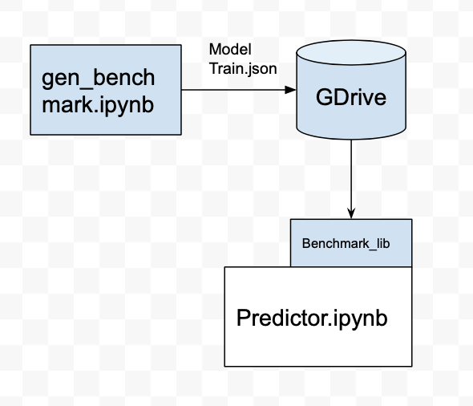
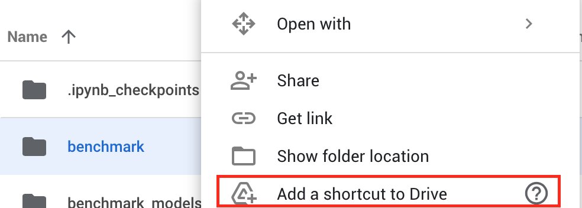

# Benchmark data generation
Data generation can be done in this notebook
https://colab.research.google.com/drive/15xCj06CZuHAxSskpSFGAtom2iEZzfdlE?usp=sharing

Basically the code would run selected model configurations for 5 epoches, and then calculate the average training time of the last 4 epochs, and saves the model to google drive into the shared folder `benchmark`.

To enable access to this shared folder, right click the folder and click `Add a shortcut to Drive` to your
Google Drive's home directory.

Now this folder should be accessable via path `/content/drive/MyDrive/benchmark`

# Use Benchmark Library
After you've got your preferred benchmark data, follow the similar steps in this notebook to run benchmark
https://colab.research.google.com/drive/14SNptCObXXkldps3a6pIsqUnb0EdlFLk?usp=sharing
